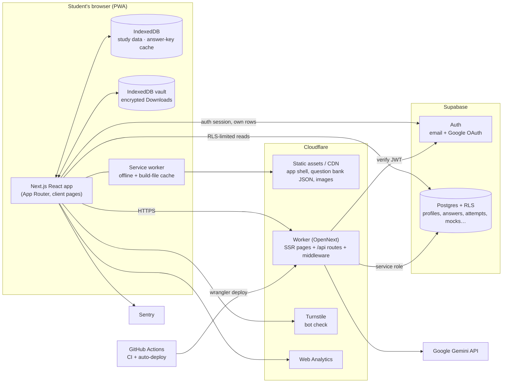
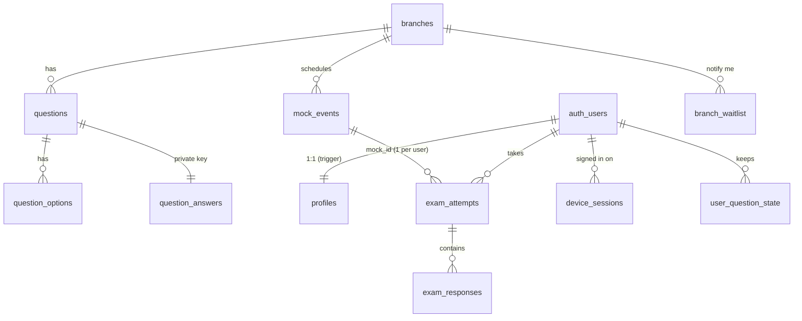
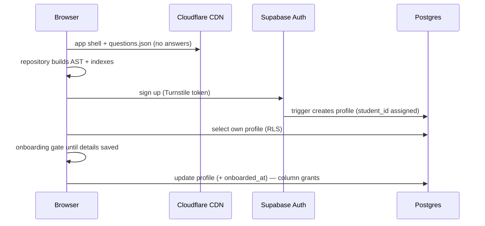

# RENYXERA — Technical Reference

*The official engineering document for RENYXERA: architecture, technology, data model,
security, every module and how they connect, and how the system is built, deployed and
operated.*

| | |
|---|---|
| **Product** | RENYXERA — GATE exam preparation platform (live branch: GATE CS & IT) |
| **Production** | https://gate.renyxera.workers.dev |
| **Repository** | `justforpersonal7771-design/RENYXERA` (branch `main`) |
| **Document owner** | Engineering |
| **Last updated** | 27 September 2026 |
| **Companion documents** | `docs/DEVELOPMENT_LOG.md` (running log of what was built and why) · `supabase/SCHEMA.sql` (complete schema) · `checklist.md` (roadmap/status) · `docs/CONTENT_STRATEGY.md` · `docs/MARKETING_STRATEGY.md` · `data/calibration/SOURCES.md` |

**How to keep this current:** every change that adds a table, route, module or external
service updates the relevant section here in the same commit, and adds an entry to
`docs/DEVELOPMENT_LOG.md`.

---

## Contents

1. [Product in one page](#1-product-in-one-page)
2. [Architecture](#2-architecture)
3. [Technology stack and why each piece is used](#3-technology-stack-and-why-each-piece-is-used)
4. [Repository layout](#4-repository-layout)
5. [Where data lives](#5-where-data-lives)
6. [Database (Supabase Postgres)](#6-database-supabase-postgres)
7. [Security and privacy model](#7-security-and-privacy-model)
8. [API reference](#8-api-reference)
9. [Modules in detail](#9-modules-in-detail)
10. [How the modules connect — key flows](#10-how-the-modules-connect--key-flows)
11. [Build, test, deploy (CI/CD)](#11-build-test-deploy-cicd)
12. [Configuration: environment variables and secrets](#12-configuration-environment-variables-and-secrets)
13. [Operations runbook](#13-operations-runbook)
14. [Capacity, limits and known gaps](#14-capacity-limits-and-known-gaps)

---

## 1. Product in one page

RENYXERA helps students prepare for GATE. Its core loop is:

**practise real questions → get marked exactly like GATE → see what went wrong → revise it →
measure progress against a goal rank.**

| Area | What it gives the student |
|---|---|
| Question bank | Every official GATE CS paper 2017–2026 (975 questions), rendered with maths (TeX) and images |
| Exam engine | Official-style test interface: full papers, subject/topic/section tests, custom tests, AI-generated practice |
| Marking | Exact GATE rules (MCQ −⅓/−⅔, MSQ/NAT no negative, multi-answer keys, "marks to all") done on the server |
| Results & review | Scoreboard, breakdowns, question grid, review mode with answers and explanations |
| Mistakes / Bookmarks / Revision | Automatic mistake bank, bookmarks with folders/tags/notes, adaptive revision queue |
| Analytics & goals | Accuracy/time analytics, streaks, achievements; target rank → marks needed → focus plan (calibrated from real results) |
| AI Mentor / Tutor | Explanations, hints, shortcuts, study plans, generated practice (Google Gemini, quota-limited) |
| All-India Mock | Weekly scheduled 180-minute mock with server-computed rank and percentile |
| Downloads | Encrypted, watermarked offline packs viewable only inside the app |
| Account | Sign-in (email/Google), onboarding with a permanent student ID, profile, preferences, devices, data export, deletion |

It is **local-first**: study data lives in the browser (IndexedDB) and works offline;
the server holds what must be trusted or shared (accounts, answer keys, graded attempts,
mocks, leaderboards).

**Constraint that shapes every decision:** the product must run entirely on free tiers
(Cloudflare, Supabase, Google AI Studio, GitHub, Sentry) until it earns revenue.

---

## 2. Architecture

### 2.1 System overview



### 2.2 The three trust zones

| Zone | Runs | Trusted with | Never trusted with |
|---|---|---|---|
| **Browser** | All UI, local engines, IndexedDB | The student's own local data | Answer keys before they're unlocked, scores that count, other people's data |
| **Worker (server)** | `/api/*` routes, middleware, SSR | Service-role DB access, Gemini key, grading, rate limits | — |
| **Postgres** | Tables, RLS policies, security-definer functions | The source of truth for accounts, keys, attempts, mocks | — |

The browser talks to Postgres directly **only** through Row Level Security (a user can read
their own rows; public tables are read-only). Anything privileged goes through a Worker
route that verifies the user's JWT and then uses the service-role key.

### 2.3 Request paths

| Request | Path |
|---|---|
| App pages, JS, CSS, images, `questions.json` | Cloudflare static assets (CDN), cached by the service worker |
| Page HTML | Worker (OpenNext) — most dashboard pages are prerendered shells hydrated in the browser |
| Sign-in / session refresh | Browser ↔ Supabase Auth directly (cookies via `@supabase/ssr`) |
| Own profile / own attempts / mock schedule | Browser → Supabase REST, filtered by RLS |
| Grading, answers, AI, devices, vault key, export, deletion, mocks start | Browser → Worker `/api/*` → Supabase (service role) |

---

## 3. Technology stack and why each piece is used

| Layer | Technology | Why it's here |
|---|---|---|
| Framework | **Next.js 15 (App Router)** + **React 19** | File-based routing, server routes for the API, prerendered pages; one codebase for UI + API |
| Language | **TypeScript 5.9** | Type safety across UI, engines and API contracts |
| Styling | **Tailwind CSS v4** (+ container queries), `tailwind-merge`, `clsx`, `class-variance-authority` | Utility styling, theming via CSS variables, components that adapt to their container |
| Motion | **motion** (Framer Motion v12) | Page/section transitions, micro-interactions; respects Reduce-motion preference |
| State | **Zustand** | Small global stores (auth, exam runtime, analytics, preferences, toasts…) |
| Local storage | **IndexedDB** via **idb** | Offline-first study data, answer-key cache, encrypted vault |
| Maths rendering | **better-react-mathjax** (MathJax 4) | TeX in questions, options, explanations |
| Markdown | **react-markdown** + **remark-gfm**, **react-syntax-highlighter** | AI responses, notes, code blocks |
| Charts | **Recharts** | Analytics charts |
| Icons / avatars | **lucide-react**, **DiceBear** (`@dicebear/core`, `@dicebear/styles`) | Icon set; avatars generated from a seed — no uploaded photos, zero storage |
| Validation | **Zod** | Every API request body is validated server-side |
| Auth + DB | **Supabase** (`@supabase/supabase-js`, `@supabase/ssr`) | Email/Google auth, Postgres with Row Level Security, free tier |
| AI | **Google Gemini** (`@google/genai`) | Explanations, hints, plans, generated practice — server-side only |
| Hosting | **Cloudflare Workers** via **@opennextjs/cloudflare** + **Wrangler** | Global edge hosting on the free plan; static assets on the CDN |
| Bot protection | **Cloudflare Turnstile** | CAPTCHA-free bot check on sign-in, sign-up, password reset (verified by Supabase) |
| Errors | **Sentry** (`@sentry/browser`) | Client error reports; anonymous user id only |
| Analytics | **Cloudflare Web Analytics** | Cookieless page-view counts |
| CI/CD | **GitHub Actions** | Type-check, build, security + engine checks, then auto-deploy |
| Testing | **Playwright** + Node check scripts | End-to-end UI checks (desktop/mobile × light/dark); engine/unit checks in CI |
| PWA | Service worker (`public/sw.js`), web manifest | Installable, offline pages, survives deploys without "chunk failed" errors |

---

## 4. Repository layout

```
app/
  (dashboard)/          signed-in/guest app: /, setup, exam/{session,results,review,diagnostics},
                        mocks, mocks/results, mistakes, bookmarks, revision, analytics,
                        ai-mentor, ai-tutor, calendar, downloads(+view), profile
  (auth)/               login, signup, reset-password(+confirm)
  (marketing)/          /about, /[slug] branch landing pages (/gate-cse, /gate-da, …)
  (legal)/              privacy, terms, cookies, refunds, disclaimer, contact
  api/                  server routes (see §8)
  auth/callback/        OAuth / email-link code exchange
  layout.tsx, sitemap.ts, robots.ts
components/             UI by area: auth, brand, dashboard, exam, layout, marketing, profile, system, ui
lib/                    engines and services (see §9): grading, repository, analytics, learning,
                        goals, calibration, ai, vault, devices, security, supabase, exam, …
store/                  Zustand stores
types/                  shared TypeScript types
data/                   Aggregated_Output.json (question bank source), image-manifest.json,
                        calibration/<branch>/<year>.json (+ SOURCES.md)
public/                 static files, brand assets, images/<year-shift>/*.png, sw.js,
                        data/ (generated: answer-free questions.json)
scripts/                seeding, schema build, checks, mock scheduler, static data copy
supabase/migrations/    numbered SQL migrations 0001…; supabase/SCHEMA.sql = all of them
docs/                   this reference, development log, strategy docs
.github/workflows/      ci.yml (checks + deploy)
```

---

## 5. Where data lives

### 5.1 On the student's device

| Store | Contents | Notes |
|---|---|---|
| IndexedDB `GatePrepOS_DB` (guest) / `GatePrepOS_DB__<userId>` (per account) | Stores: `Metadata`, `QuestionCache`, `ExamSessions` (history + `active_session`), `UserMutations`, `AnalyticsSnapshots`, `StudyMetrics`, `Mistakes`, `Bookmarks`, `CustomTemplates`, `AIResponses`, `AIGeneratedQuestions`, `AIMemory`, calendar/to-do | One database per account so two people on one device never see each other's data. Opens only after the sign-in state is known. Guest data migrates into a new account on sign-up. |
| IndexedDB `Metadata` key `answer_keys_v1` | Unlocked answer keys | Lets history, review and analytics work offline |
| IndexedDB `RenyxeraVault__<userId>` | Encrypted Downloads packs + a **non-extractable** AES key | Deleted on sign-out and on account deletion |
| localStorage | `theme`, `renyxera_prefs` (motion, reminders), `renyxera_device_id`, `renyxera_grid_mode`, `renyxera_custom_degrees`, `renyxera_seen_achievements`, `gateos_recent_searches` | Per-device conveniences only |
| sessionStorage | `renyxera_intro_seen`, `renyxera_just_signed_out`, `renyxera_stale_reload_at` | Short-lived flags |
| Service-worker caches | `gateos-pwa-cache-vN` (pages, JSON), `renyxera-static-v1` (content-hashed build files, survives deploys, capped at 800 entries) | API responses are never cached |
| Supabase auth cookies | `sb-…-auth-token` | Set by `@supabase/ssr` |

### 5.2 On the server

Supabase Postgres (§6). Nothing else stores user data. The Worker is stateless (its
in-memory rate limiter is per-isolate and best-effort).

### 5.3 Static data (public, CDN)

| File | Contents | Built by |
|---|---|---|
| `public/data/questions.json` | All 975 questions **without answers** | `scripts/copy-static-data.mjs` (runs before every build; the build fails if an answer field leaks) |
| `public/data/image-manifest.json` | Image file names per paper | same |
| `public/images/<year-shift>/*.png` | Question and option figures | committed assets |

---

## 6. Database (Supabase Postgres)

The complete, runnable schema is `supabase/SCHEMA.sql` (all migrations in order). Below is
what each object is for.

### 6.1 Migrations

| # | File | What it did |
|---|---|---|
| 0001 | `0001_init.sql` | Core schema: branches, questions (+options, private answers), profiles (+signup trigger), exam attempts/responses, user question state, waitlist |
| 0002 | `0002_username_lowercase.sql` | Usernames lowercase-only, format check, case-insensitive uniqueness |
| 0003 | `0003_ai_quota_and_cache.sql` | Atomic daily AI quota function; server-side AI response cache |
| 0004 | `0004_graded_attempts.sql` | `question_answers.nat_ranges` (NAT keys with several accepted ranges) |
| 0005 | `0005_device_sessions.sql` | Active Devices table + function to end one auth session |
| 0006 | `0006_waitlist_hardening.sql` | Removed open waitlist inserts; dedupe + uniqueness |
| 0007 | `0007_profile_fields_and_update_lockdown.sql` | Profile details, student IDs, onboarding; **column-level update grants** (security fix) |
| 0008 | `0008_student_id_format.sql` | Student ID format `RNX-GATE-<BRANCH>-<6 digits>` |
| 0009 | `0009_all_india_mocks.sql` | Scheduled mocks, one-attempt-per-mock, leaderboard function |
| 0010 | `0010_mock_timing_and_leaderboard_privacy.sql` | Late-start grace per mock; leaderboard display choice (anonymous / username / username + student ID) |

**Procedure for schema changes:** add `supabase/migrations/NNNN_name.sql` (idempotent:
`if not exists`, `drop … if exists` before `create`), run it in the Supabase SQL editor,
verify, then `npm run schema:build` and update this section.

### 6.2 Tables

#### `branches` — GATE papers the product knows about
| Column | Type | Notes |
|---|---|---|
| `code` | text PK | `CSE`, `DA`, `ECE`, `EE`, `ME`, `CE` |
| `name` | text | Full name |
| `status` | text | `live` \| `coming_soon` |
| `question_count` | int | Maintained by the seed script |
| `sort_order` | int | |
RLS: public read.

#### `questions` — public half of the question bank
| Column | Type | Notes |
|---|---|---|
| `id` | text PK | e.g. `GATE_CS_2026_FN_Q1` |
| `branch_code` | text → branches | |
| `year`, `session`, `question_no` | | Paper identity |
| `question_type` | text | `MCQ` \| `MSQ` \| `NAT` |
| `marks` | numeric | 1 or 2 |
| `section`, `subject`, `topic`, `difficulty` | text | Tags |
| `question_text` | text | Markdown + TeX, image tokens like `[IMAGE_Q_02_1]` |
| `has_image`, `image_paths` | | Relative paths only |
Indexes on branch, subject, topic. RLS: public read.

#### `question_options` — public options (no correctness column by design)
PK (`question_id`, `option_id`); `text`, `image_path`. RLS: public read.

#### `question_answers` — **private** answer key
| Column | Notes |
|---|---|
| `question_id` PK → questions | |
| `correct_option_ids` text[] | MCQ: 1 (or several when the official key accepts several / "marks to all"); MSQ: ≥1 |
| `nat_min`, `nat_max` | First accepted NAT range |
| `nat_ranges` jsonb | All accepted NAT ranges `[[min,max],…]` |
| `solution_text`, `solution_image_paths` | Reserved for written solutions |
RLS **enabled with no policies** → only the service role can read it.

#### `profiles` — one row per account
Created automatically by trigger `on_auth_user_created` → `handle_new_user()`.

| Column | Notes |
|---|---|
| `id` PK → auth.users (cascade) | |
| `username` | Lowercase `^[a-z][a-z0-9_]{2,19}$`, unique case-insensitively |
| `display_name`, `bio`, `college`, `degree`, `graduation_year`, `state`, `city`, `aspirant_status`, `attempt_number` | Personal details (checked lengths/ranges) |
| `avatar_seed`, `avatar_style` | DiceBear avatar (never an uploaded photo) |
| `target_branch`, `target_year`, `target_rank`, `target_score`, `exam_date`, `daily_study_hours`, `study_days_per_week`, `preferred_study_time` | Goals |
| `student_id` | Unique, not null, format `RNX-GATE-CSIT-100001`, assigned from sequence `student_id_seq` — **immutable for users** |
| `onboarded_at` | Null until the required setup is done; check: can't be set without username, display name, target year |
| `leaderboard_display` | `anonymous` \| `username` \| `username_student_id` (`leaderboard_opt_in` is the older boolean it replaced) |
| `tier`, `entitlements`, `daily_ai_calls`, `daily_ai_reset_at`, `status`, `phone*`, `active_session_id` | **Server-only** fields |
| `created_at`, `updated_at` | `updated_at` maintained by trigger |
RLS: users can **select** and **update** only their own row. **Column-level grants** limit
updates to the personal/goal/display columns above — a user cannot change `tier`,
`entitlements`, AI counters, `status` or `student_id` even on their own row.

#### `exam_attempts` — server record of a test
| Column | Notes |
|---|---|
| `id` uuid PK | Same id as the browser's session (idempotency key) |
| `user_id` → auth.users | |
| `branch_code`, `config` (jsonb: title) | |
| `question_ids` text[] | Exact question set at start |
| `mode` | `practice` \| `graded` |
| `server_started_at`, `duration_seconds` | Set by `/api/exam/start` (the attempt token) |
| `submitted_at`, `server_score`, `server_max` | Set by `/api/exam/grade` |
| `status` | `in_progress` \| `submitted` \| `expired` |
| `integrity_flags` jsonb | e.g. `[{"code":"tab_switches","value":6}]` — never changes the score |
| `mock_id` → mock_events | Set for All-India mocks; unique (`user_id`, `mock_id`) = one attempt per mock |
| `percentile`, `air` | Reserved |
RLS: users read their own; all writes are server-only.

#### `exam_responses` — per-question answers of an attempt
`attempt_id`, `question_id`, `selected_option_ids`, `nat_value`, `time_spent_seconds`,
`marked_for_review`. RLS: read own (via the attempt); append-only, server writes.

#### `user_question_state` — cloud mirror of bookmarks/mistakes/notes (reserved for Cloud Sync)
PK (`user_id`, `question_id`). RLS: full CRUD on own rows.

#### `branch_waitlist` — "Notify me" for coming-soon branches
`branch_code`, `email` (≤254) and/or `user_id`. Unique per branch by lower(email) and by
user. No public policies — inserts only through `/api/waitlist`.

#### `device_sessions` — Active Devices
`user_id`, `device_id` (random per browser), `session_id` (from the verified JWT), `label`
("Chrome on Windows"), `created_at`, `last_seen_at`, `revoked_at`. Unique (`user_id`,
`device_id`). RLS: read own; writes server-only.

#### `ai_response_cache` — server cache of AI answers
`prompt_hash` PK (sha-256 of model + instruction + prompt), `response`, `hits`. Service role only.

#### `mock_events` — scheduled All-India mocks
| Column | Notes |
|---|---|
| `id` uuid PK, `title`, `branch_code` | |
| `starts_at` | Paper start (Sunday 10:00 IST) |
| `start_grace_minutes` | Starts accepted until `starts_at + grace` (default 30) |
| `ends_at` | Hard close = last start + duration (13:30 IST) |
| `results_at` | Ranks released (13:45 IST) |
| `question_ids` text[] | The paper (65 questions) |
| `duration_seconds` | 10 800 (exactly 180 minutes) |
RLS: public read (the schedule and question ids are public; answers are not). Created by
`scripts/schedule-mocks.mjs` (service role).

### 6.3 Functions and triggers

| Object | Kind | Purpose | Callable by |
|---|---|---|---|
| `handle_new_user()` + trigger `on_auth_user_created` | trigger | Creates the `profiles` row for every new auth user (defaults fill `student_id`) | Postgres |
| `set_updated_at()` + trigger `profiles_set_updated_at` | trigger | Maintains `updated_at` | Postgres |
| `consume_ai_call(p_user, p_limit)` | security definer | Atomic daily AI quota check-and-increment (day rolls over at midnight IST) | service role only |
| `revoke_auth_session(p_user, p_session)` | security definer | Deletes one `auth.sessions` row (sign out a single device) | service role only |
| `mock_leaderboard(p_mock, p_limit)` | security definer, stable | Rank + percentile for a mock after results release; only submitted, on-time, unflagged attempts; display per each person's choice; always includes the caller | anon, authenticated |
| `student_id_seq` | sequence | Student ID numbers from 100001 | default of `profiles.student_id` |

### 6.4 Entity relationships



---

## 7. Security and privacy model

### 7.1 Principles
1. **The browser is untrusted.** Scores, answer keys, entitlements and identity are decided on the server.
2. **Least privilege in the database.** RLS on every table; private tables have no policies; column-level update grants on `profiles`.
3. **The service-role key never reaches the browser.** `lib/supabase/service-role.ts` imports `server-only` (build fails if bundled client-side); CI greps the build output for it (`npm run check:security`).
4. **Every API input is validated** with Zod, size-capped, origin-checked and rate-limited.

### 7.2 Controls

| Threat | Control |
|---|---|
| Bots creating accounts / abusing sign-in | Cloudflare Turnstile verified by Supabase Auth (sign-in, sign-up, reset) |
| Reading answer keys in bulk | Keys not in the public bundle; `/api/answers` capped (100 ids, rate-limited per user/IP); build fails if an answer field leaks into `questions.json` |
| Faking a score | Server grading from Postgres keys; attempt token (server start time, question set, time limit); integrity flags |
| Editing one's own tier/entitlements/student ID | Column-level grants (migration 0007) |
| Cross-site requests | `isCrossOriginRequest` on every mutating route |
| AI cost abuse | Sign-in required; atomic per-user daily quota in Postgres; response cache |
| Stolen session on another device | Active Devices: sign out one device / others / everywhere (deletes the auth session; the device signs itself out on its next check-in) |
| Shared device | Per-account IndexedDB namespaces; store reset on account switch; vault wiped on sign-out |
| Leaked offline packs | AES-GCM encryption, non-extractable key, 14-day renewal, watermark with email + id, no file export |
| Protected pages | Middleware redirects signed-out visits to `/profile` and `/downloads` |
| Exam integrity | Flags: `no_start_token`, `over_time`, `long_pause`, `question_set_mismatch`, `tab_switches` (≥5), `fullscreen_exits` (≥3), `rapid_answers` (≥10 under 5 s). Flagged attempts are excluded from leaderboards, never deleted |

### 7.3 Identifiers and privacy
- **Username** and **student ID** are public-facing labels only. No route signs anyone in, looks anyone up, or changes anything by username or student ID. The only username route (`/api/username/check`) requires sign-in, is rate-limited and returns only "available"/"taken".
- A student ID is assigned by the database, unique and permanent; users cannot edit it.
- Leaderboards show what each person chose: *anonymous* ("Aspirant 0023"), *username*, or *username + student ID*. Emails are never shown to other users.
- Profiles are readable only by their owner (RLS). The leaderboard function exposes only rank, the chosen display label, score and percentile.
- Monitoring sends an anonymous user id (never name/email); URLs are stripped of query strings.
- "Export my data" (JSON) and "Delete my account" (type your email; cascades to profile, attempts, responses, devices) are self-serve.

---

## 8. API reference

All routes live under `app/api/*/route.ts`, run on the Worker (`runtime = "nodejs"`),
reject cross-origin requests, and return JSON.

| Route | Method | Auth | Rate limit | Purpose |
|---|---|---|---|---|
| `/api/answers` | POST | optional | 40/min user, 12/min guest | Unlock answer keys for ≤100 question ids (practice screens, history catch-up) |
| `/api/exam/start` | POST | required | 20/min | Attempt token: records server start, question set, time limit; mocks: enforces entry window, exact paper, one attempt |
| `/api/exam/grade` | POST | optional | 20/min | Server grading; for signed-in attempts stores the attempt (idempotent), responses and integrity flags; returns the test's keys |
| `/api/ai/generate` | POST | required | 15/min + daily quota | Server-side Gemini call from a fixed prompt template; cached |
| `/api/vault/key` | POST | required | 20/min | Per-account key for encrypted Downloads (HMAC of a server secret) |
| `/api/devices` | GET/POST | required | 30/min | List devices; heartbeat; revoke one; revoke others |
| `/api/account/export` | GET | required | 5/min | Server-held data as JSON (browser adds local data) |
| `/api/account/delete` | POST | required | 3/10 min | Delete account after typed-email confirmation |
| `/api/username/check` | GET | required | 40/min | Username availability only |
| `/api/waitlist` | POST/GET | optional | 6/10 min per IP | Join a branch waitlist (honeypot, dedupe); public counts |
| `/api/image-manifest` | GET | none | 20/min | Legacy image manifest endpoint (static file preferred) |
| `/auth/callback` | GET | — | — | Exchanges the OAuth/email-link code for a session |

---

## 9. Modules in detail

Each module lists **purpose → main code → how it works → what it depends on → what depends on it**.

### 9.1 Platform shell, theming and PWA
- **Code:** `app/layout.tsx`, `components/layout/*` (topbar, client-layout, footer), `app/globals.css`, `public/sw.js`, `lib/stale-deploy.ts`, `components/ui/tooltip-layer.tsx`, `components/system/motion-prefs.tsx`.
- **How:** the root layout sets fonts, the theme bootstrap script (no flash), a stale-deploy guard (reloads once if a build file of a previous deploy is missing), the auth listener and the app-wide tooltip layer (replaces native `title` tooltips). The client layout loads the question repository, registers the service worker and asks it to warm the offline cache when idle. The service worker is network-first for pages, cache-first for content-hashed build files (kept across deploys), and never touches `/api` or router prefetch requests.
- **Depends on:** nothing. **Used by:** every page.

### 9.2 Authentication, onboarding and identity
- **Code:** `app/(auth)/*`, `components/auth/*` (forms, Turnstile widget, auth modal, onboarding gate), `components/system/auth-listener.tsx`, `lib/supabase/*`, `middleware.ts` → `lib/supabase/middleware.ts`, `store/use-auth-store.ts`.
- **How:** Supabase Auth (email + Google). Turnstile token is required by Supabase for password flows. The auth listener resolves the session, switches the IndexedDB namespace, migrates guest data on sign-up, loads the profile (`select *`), runs the Active Devices heartbeat, and wipes the vault on sign-out. The **onboarding gate** blocks the app for accounts without `onboarded_at` until display name, unique username, target year and status are saved (survives reloads; enforced by a DB check); the welcome screen shows the permanent student ID. Middleware protects `/profile` and `/downloads`.
- **Used by:** everything that needs identity.

### 9.3 Profile, preferences, account and devices
- **Code:** `app/(dashboard)/profile/page.tsx`, `components/profile/*` (header, avatar studio, goal plan, stats/achievements, account settings, data & storage), `lib/degrees.ts`, `lib/devices/device.ts`, `app/api/devices`, `app/api/account/*`, `store/use-preferences-store.ts`, `lib/hard-reset.ts`.
- **How:** fixed header + section menu (Overview, Personal info, Exam goals, Preferences, Account & security, Devices, Data & storage) with `#hash` deep links; one form state with a floating save bar; avatar studio (styles + variations); searchable degree picker with add-your-own; bio suggestions built locally from profile details; Preferences (theme, motion, reminders) stored per device; Account (email, providers, password change, export, delete); Devices (list, sign out one/others/everywhere); Data & storage (usage, clear offline cache, hard reset).

### 9.4 Question bank and repository
- **Code:** `data/Aggregated_Output.json`, `scripts/copy-static-data.mjs`, `scripts/seed-questions.mjs`, `lib/repository/question-repository.ts`, `lib/repository/transformers/*` (AST parser, normalizer), `lib/services/image-resolver.ts`, `store/use-data-store.ts`.
- **How:** the source JSON is (a) stripped of answers into `public/data/questions.json` for the CDN and (b) seeded into Postgres with answers in the private table. In the browser the repository fetches the public file, parses text into an AST (Markdown/TeX/images), resolves image tokens via the manifest, builds indexes (by id, subject, topic, section, paper, difficulty) and exposes query methods (e.g. `getAvailablePapers()` newest first).
- **Used by:** exam engine, analytics, revision, AI, downloads, mocks.

### 9.5 Answer keys and grading
- **Code:** `lib/grading.ts` (single source of truth), `lib/repository/answer-keys.ts`, `app/api/answers`, `app/api/exam/grade`, `components/exam/answers-pending-banner.tsx`, `scripts/check-grading.mts`, `scripts/check-answer-keys.mjs`.
- **How:** `lib/grading.ts` implements GATE marking (NAT multi-range with float tolerance, strict number parsing, MCQ multi-answer / marks-to-all, MSQ exact set, −marks/3 for wrong MCQ). Keys are unlocked on submit (grade response) or per question (practice), merged into the in-memory questions, cached in IndexedDB, and caught up once for older history. If a test is submitted offline, answers show as **Pending** (never counted wrong) and grading retries on reconnect. Grading of one attempt is de-duplicated in the browser and idempotent on the server.

### 9.6 Exam engine (setup → session → submit → results → review)
- **Code:** `app/(dashboard)/setup`, `lib/exam/exam-builder.ts`, `lib/exam/session-manager.ts`, `store/use-exam-store.ts` (draft), `store/use-exam-runtime-store.ts` (live session), `app/(dashboard)/exam/session`, `components/exam/*` (question/option renderers, palette, section tabs, timer, submit dialog), `app/(dashboard)/exam/results`, `.../results/review`.
- **How:** Setup builds a draft (year paper, subject/section/topic test, custom blocks, AI practice; guests capped at 15 questions). Starting creates a session (persisted as `active_session` in IndexedDB) and — when signed in — registers an attempt token with `/api/exam/start`. The session UI shows the section switcher in the top bar, the question grid (by section or all), a timer (time-on-screen for practice; wall-clock deadline for mocks), marking/clearing, and records integrity signals (tab switches, fullscreen exits, pauses). Submit saves locally and shows "Test submitted" instantly; server grading, mistakes processing and analytics refresh run in the background. Results and review read the session from IndexedDB and recompute with unlocked keys.

### 9.7 All-India Mock and leaderboards
- **Code:** `supabase/migrations/0009…`, `0010…`, `scripts/schedule-mocks.mjs`, `app/api/exam/start` (mock rules), `app/(dashboard)/mocks/page.tsx`, `app/(dashboard)/mocks/results/page.tsx`.
- **Timing (mirrors the real exam):** paper Sunday 10:00–13:00 IST, exactly 180 minutes, no pause. Starts accepted 10:00–10:30 (grace for network/server trouble); every attempt still gets 180 minutes, so the hard close is 13:30. Results and ranks at 13:45.
- **Paper:** 65 questions / 100 marks in the official split — GA 5×1 + 5×2; Maths 5×1 + 4×2; Core CS 20×1 + 26×2 — spread across subjects, avoiding questions used in the last 8 mocks.
- **Question order:** everyone gets the same 65 questions, each person in a different order — General Aptitude first, then Maths + Core CS mixed (`lib/exam/mock-order.ts`, seeded by user + mock so a reload or another device keeps the order). Answers and grading are keyed by question id and scores are rounded to 2 decimals, so order never changes marks or ranks (`npm run check:mock-order`, in CI).
- **Rules (server-enforced):** start only within the entry window; exact paper; one attempt per person (unique index); timer is a wall-clock deadline from the server start; submissions after the hard close (+2 min) are not ranked; flagged attempts are not ranked.
- **Peak-load behaviour:** questions come from the CDN (no server load); start and submit retry with exponential backoff + jitter; start reuses one attempt id (retry = resume); grading is idempotent; auto-submit happens at each person's own deadline, spreading load.
- **Leaderboard:** `mock_leaderboard()` returns top N + the caller, rank, percentile = share of ranked aspirants scored above; display per privacy choice.

### 9.8 Analytics and learning engines
- **Code:** `lib/analytics/*` (analytics, mistake, snapshot, streak, goal-slider engines), `lib/learning/*` (Learning, Mastery, Focus, Adaptive, Recommendation engines), `store/use-analytics-store.ts`, `app/(dashboard)/analytics`, dashboard widgets, `lib/achievements.ts`.
- **How:** engines compute metrics from local session history (correctness via `lib/grading.ts`), cache them, and invalidate after each submit. Mistake engine records wrong/unanswered questions (skips answers still locked). Streaks and 15 achievements come from real activity.

### 9.9 Goals engine and calibration
- **Code:** `lib/goals/goal-engine.ts`, `lib/goals/exam-year.ts`, `lib/calibration.ts`, `data/calibration/cse/<year>.json`, `data/calibration/SOURCES.md`, `components/profile/goal-plan.tsx`, `scripts/check-goal-engine.mts`, `scripts/check-calibration.mts`.
- **How:** calibration blends published marks↔rank tables (2023–2025, cited) into a median curve with a low/high band, adds qualifying marks (all categories, 2023–2026) and the official GATE score formula. The goals engine turns target rank → marks needed → syllabus coverage by past-paper weight → a focus plan and a feasibility check against days × hours. The UI shows ranges and the data vintage, never a single falsely precise rank.

### 9.10 Mistakes, bookmarks and revision
- **Code:** `app/(dashboard)/mistakes`, `bookmarks`, `revision` (+ `revision/session`), `store/use-study-store.ts`, `components/auth/guest-local-notice.tsx`.
- **How:** local-first stores with folders, tags, priority, notes (Markdown); validate-your-answer flows unlock keys per question; revision queue prioritises weak topics and mistakes.

### 9.11 AI Mentor and AI Tutor
- **Code:** `app/(dashboard)/ai-mentor`, `ai-tutor`, `lib/ai/*`, `app/api/ai/generate`.
- **How:** the browser sends a template **type** + structured data, never instructions; the server builds the prompt, fills in the official answer for GATE questions itself, checks the cache, consumes the daily quota atomically, calls Gemini and caches the result. Guests get no AI calls.

### 9.12 Downloads (protected offline packs)
- **Code:** `app/(dashboard)/downloads` (+ `view`), `lib/vault/vault.ts`, `app/api/vault/key`.
- **How:** packs (a paper or subject: question ids + answer keys) are AES-GCM encrypted into a per-account IndexedDB vault with a non-extractable key (renewed online, valid 14 days offline). The viewer watermarks every page with the account's email and id, blocks copy/print/context menu, and blurs on focus loss. Honest limit: screenshots can't be prevented; leaks are traceable.

### 9.13 Planner (calendar and to-do)
- **Code:** `app/(dashboard)/calendar`, topbar quick panels, `lib/notifications/reminder-scheduler.ts`.
- **How:** local events/tasks with reminders (browser notifications, gated by the Preferences switch).

### 9.14 Marketing, SEO and waitlist
- **Code:** `app/(marketing)/*`, `lib/branches.ts`, `components/marketing/notify-form.tsx`, `app/api/waitlist`, `app/sitemap.ts`, `app/robots.ts`, `lib/site.ts`.
- **How:** static branch pages with syllabus, candidate trends (cited), FAQ structured data and a "Notify me" form; sitemap/robots keep private pages out of search.

### 9.15 Legal
- **Code:** `app/(legal)/*` — privacy, terms, cookies, refunds, disclaimer, contact. Written to match actual behaviour.

### 9.16 Monitoring
- **Code:** `lib/monitoring.ts`, dashboard error boundary, root layout beacon.
- **How:** Sentry (lazy-loaded, errors only, PII stripped) and Cloudflare Web Analytics (cookieless) — both switched off unless their public keys are set.

---

## 10. How the modules connect — key flows

### 10.1 First visit to signed-in study


### 10.2 Taking and grading a test
```mermaid
sequenceDiagram
  participant B as Browser
  participant W as Worker
  participant DB as Postgres
  B->>W: POST /api/exam/start (attempt id, questions)
  W->>DB: insert exam_attempts (in_progress, server start, limit)
  Note over B: answer questions; signals counted
  B->>B: Submit → save locally → "Test submitted" (instant)
  B->>W: POST /api/exam/grade (responses, signals) — background, retried
  W->>DB: read keys + marks (service role)
  W->>W: grade (lib/grading) + integrity flags
  W->>DB: update attempt (score, flags) + insert responses
  W-->>B: score + answer keys
  B->>B: cache keys → results, mistakes, analytics
```

### 10.3 All-India Mock day
1. **Before 10:00:** `/mocks` shows the countdown; the paper's questions are already in the CDN bank.
2. **10:00–10:30:** Start → `/api/exam/start` checks window/paper/one-attempt, returns start time and 180-minute limit (retries with jitter at the rush) → session with a wall-clock deadline.
3. **During:** no pause; leaving keeps the clock running; signals recorded.
4. **At each person's deadline:** auto-submit → background grading with retries (idempotent).
5. **13:30:** hard close. **13:45:** `mock_leaderboard()` returns ranks and percentiles.

### 10.4 Dependencies at a glance
```
auth ─┬─> profile/onboarding ──> goals engine ──> calibration data
      ├─> devices, vault (downloads), account export/delete
      └─> exam start/grade ──> answer keys ──> results/review ──> mistakes/revision
question repository ──> exam builder ──> session ──┘         └──> analytics/achievements
mock schedule ──> mocks page ──> exam session ──> grading ──> leaderboard
```

---

## 11. Build, test, deploy (CI/CD)

| Stage | Command / file | What it does |
|---|---|---|
| Static data | `prebuild` → `scripts/copy-static-data.mjs` | Writes answer-free `questions.json` (fails on leak) + manifest |
| Build | `npm run build` | Next.js production build |
| Cloudflare build/deploy | `npm run deploy:cf` | OpenNext build + `wrangler deploy` |
| Checks | `check:security`, `check:goals`, `check:grading`, `check:calibration`, `check:mock-order`, `check:keys` | Service-role leak + anon-can't-read-keys; goals engine acceptance; 50 grading edge cases; calibration consistency; mock order (same paper, GA first, order-independent score); answer-key integrity (manual) |
| CI | `.github/workflows/ci.yml` job `check` | Install, type-check, lint (informational), build, all checks |
| CD | same workflow, job `deploy` | Runs only on push to `main` (or manual "Run workflow") **after `check` passes**; deploys; smoke-tests `/`, `/about`, `/gate-cse`, `/sitemap.xml` |
| E2E | Playwright scripts (local) | Desktop 1440 + mobile 390, light + dark; signed-in tests use an admin magic-link helper |

**Release rule:** commit locally as you go; push to `main` once per finished batch — the
push *is* the deploy.

---

## 12. Configuration: environment variables and secrets

| Name | Where | Public? | Purpose |
|---|---|---|---|
| `NEXT_PUBLIC_SUPABASE_URL` | `.env.local`, GitHub secret | yes | Supabase project URL |
| `NEXT_PUBLIC_SUPABASE_PUBLISHABLE_KEY` | `.env.local`, GitHub secret | yes | Anon/publishable key (RLS applies) |
| `NEXT_PUBLIC_TURNSTILE_SITE_KEY` | `.env.local`, GitHub secret | yes | Turnstile widget |
| `NEXT_PUBLIC_SENTRY_DSN` | `.env.local`, GitHub secret | yes | Sentry (off if unset) |
| `NEXT_PUBLIC_CF_BEACON_TOKEN` | `.env.local`, GitHub secret | yes | Web Analytics (off if unset) |
| `NEXT_PUBLIC_SITE_URL` | optional | yes | Canonical URL (defaults to workers.dev) |
| `SUPABASE_SERVICE_ROLE_KEY` | `.env.local`, **Worker secret** | **no** | Service-role DB access (server only); also the HMAC secret for vault keys |
| `GEMINI_API_KEY` | **Worker secret** | **no** | Gemini |
| `AI_DAILY_LIMIT` | Worker var (optional) | — | Per-user daily AI calls (default 30) |
| `CLOUDFLARE_API_TOKEN`, `CLOUDFLARE_ACCOUNT_ID` | GitHub secrets | no | CI deploys |
| Turnstile secret | Supabase dashboard (Auth → Captcha) | no | Server-side token verification |

Secrets are never pasted into chat or committed. Worker secrets: `npx wrangler secret put NAME`.

---

## 13. Operations runbook

| Task | How |
|---|---|
| Apply a migration | Supabase → SQL Editor → paste `supabase/migrations/NNNN_*.sql` → Run → verify in Table Editor → `npm run schema:build` |
| Re-seed questions / keys | `npm run seed:questions` then `npm run check:keys` |
| Schedule mocks | `node --env-file=.env.local scripts/schedule-mocks.mjs 4` (next 4 Sundays; skips already scheduled) |
| One-off test mock | `node --env-file=.env.local scripts/schedule-mocks.mjs --at=2026-09-27T13:00:00+05:30 "--title=Test Mock"` (same paper rules, grace and 180 min; not numbered) |
| Refresh calibration (each March) | Update `data/calibration/cse/<year>.json` + `SOURCES.md` → `npm run check:calibration` |
| Redeploy without a commit | GitHub → Actions → CI → Run workflow (main) |
| Rotate a secret | Update Worker secret / GitHub secret → manual redeploy |
| A user reports a stuck page | Profile → Data & storage → Clear offline cache (or hard reset this device) |
| Investigate errors | Sentry project `renyxera`; Cloudflare Worker logs |

---

## 14. Capacity, limits and known gaps

**Free-tier capacity (planning numbers):**
- Cloudflare Workers free: 100 000 requests/day, 10 ms CPU per request (hence static question bank, prerendered pages, no heavy work in routes).
- Supabase free: 500 MB database, 50 000 monthly active users, pooled REST connections. A mock submit is ~3 reads + 2 writes; a few thousand concurrent mock submits spread by personal deadlines and retried with backoff are within reach; beyond that, move to Supabase Pro or queue grading.
- Gemini free tier: per-minute/day request limits → per-user daily quota + cache.
- The in-memory rate limiter is per Worker isolate (best-effort); database-level limits back the critical paths (AI quota, one attempt per mock, unique waitlist).

**Known gaps / next:** see `checklist.md` — official marks↔rank table and category curves;
cloud sync of study data (4I); per-day download cap; rasterised "flattened" downloads;
payments and entitlements (Release 7); exam/branch picker for multi-branch (backlog #7);
re-enable email confirmation with custom SMTP once there's revenue (backlog #5).
